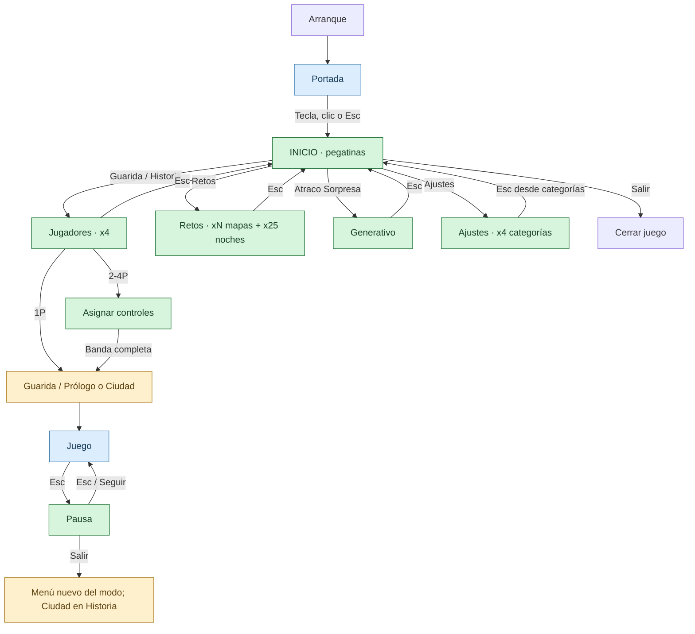
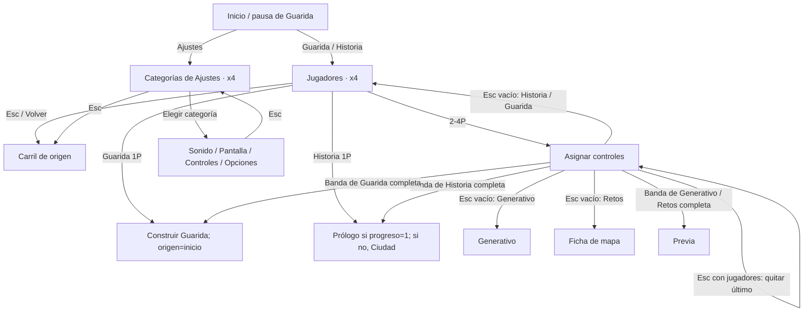
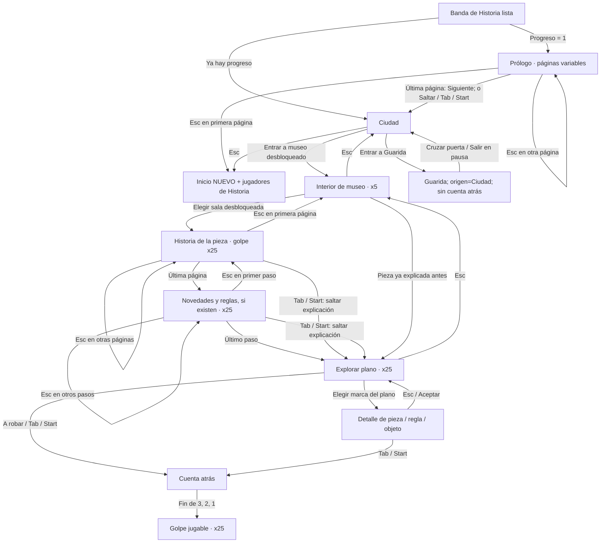
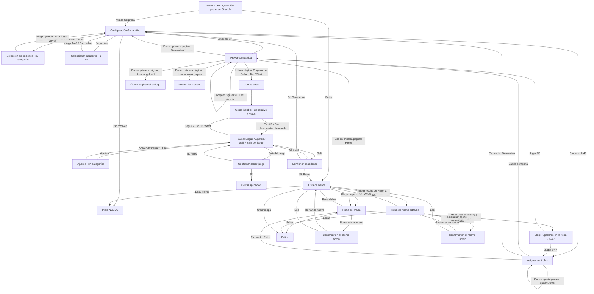
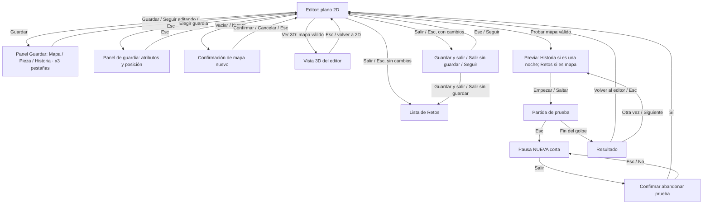
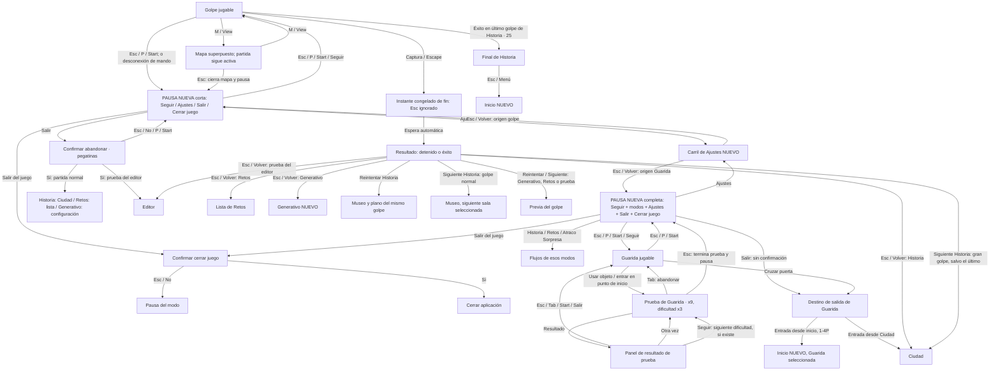

# Navegación de pantallas: estado actual

Revisado contra el código el 1 de octubre de 2026. Describe lo que hace el juego ahora, incluidas las vueltas inesperadas; no es una propuesta de navegación.

**Verde:** todos los menús interactivos usan pegatinas (`Hub`). **Azul:** ciudad, museo, editor y juego. **Naranja:** confirmaciones o destinos que dependen del contexto. El prólogo, las previas y los resultados conservan sus diseños propios.

Se agrupan los patrones repetidos: museos **x5**, golpes de Historia **x25**, jugadores **x4**, ajustes **x4**, pruebas de guarida **x9** con dificultades **x3**. Los mapas de Retos son una colección variable, **xN**. Las pantallas de Historia y los paneles de resultados tienen su propio diseño, aunque usen el HUD; no son el menú principal viejo.

Las flechas etiquetadas `Esc` describen esa tecla. `Aceptar` suele ser E, punto, Espacio, Enter o A del mando; también se puede elegir con ratón. Las excepciones de asignación de controles y editor están explicadas abajo.

## 1. Mapa general: todos los retornos usan el menú nuevo

No hay rutas activas al menú antiguo. La copia histórica está en [archive/menus-antiguos-2026-10-01](../archive/menus-antiguos-2026-10-01/README.md): proyecto restaurable y **37 escenas `.tscn` reutilizables**. Las escenas 3D compartidas del prólogo y las lecciones siguen en el juego.

## 2. Menús, jugadores y ajustes

En asignación, Esc elimina **el último jugador**; solo vuelve de pantalla cuando se pulsa con la lista vacía. B del mando o la tecla de vuelta de cada lado del teclado elimina su propio asiento; no equivale siempre a Esc. Cuando todos están asignados, se avanza automáticamente tras 0,8 segundos.

Ajustes conserva el origen: desde inicio vuelve al inicio; desde pausa vuelve a la pausa completa de Guarida o corta del golpe. Los valores se cambian con arriba/abajo, stick vertical, Aceptar o los botones +/−.

## 3. Historia: ciudad, museos y golpes agrupados

Esc durante las animaciones de entrada, salida, elevación del plano o transición al golpe no cambia de pantalla: los estados `zoom` y `going` no tienen ruta de vuelta.

## 4. Generativo, Retos y previa compartida

La previa agrupa **historia de la pieza**, **novedades** y **plano/reglas**; algunas páginas se omiten según modo y pieza. La entrada habitual de Historia desde la Ciudad usa el plano interactivo del diagrama anterior; esta previa se usa en Generativo, Retos y pruebas del editor. Un mapa inválido no ofrece jugar ni permite probar/ver en 3D desde el editor.

**Jugadores y pausa en ambos modos.** Generativo abre una pantalla de selección de 1–4 jugadores y vuelve a la configuración antes de Empezar. Retos ofrece Jugar 1P, 2P, 3P y 4P dentro de la ficha de cada mapa válido; no abre otra pantalla para elegir el número. Con 2–4 jugadores, ambos pasan por Asignar controles. Durante el golpe, ambos tienen la pausa corta, con Seguir, Ajustes, Salir y Salir del juego; abandonar vuelve a la configuración de Generativo o a la lista de Retos.

## 5. Editor y sus paneles

Las categorías del catálogo (construcción, aspecto, dificultad, etc.) y las pestañas de guardia/guardar cambian contenido dentro del editor, sin abrir una pantalla de juego distinta. Esc cierra primero el panel abierto; después sale del 3D si está activo; solo después intenta abandonar el editor. En un desplegable nativo abierto, Esc puede cerrar ese desplegable antes de llegar al editor. B del mando tiene además comportamiento de foco/deshacer; no es idéntico a Esc.

**Excepción de implementación:** Esc desde la **primera página de la previa de una prueba** no usa el retorno especial al editor: va a la ficha del mapa, al museo o al prólogo según el modo. Los resultados y la confirmación de abandonar sí usan el retorno al editor.

## 6. Juego, pausa, resultados y pruebas de Guarida

El panel de resultado de una prueba ignora Aceptar/Esc durante los primeros **0,4 segundos**. Luego Esc sale a la guarida, sin abrir pausa. Esc mientras la prueba todavía se juega sí pausa y termina la prueba.

La pausa se abre directamente con pegatinas. «Salir» abandona el modo; «Salir del juego» pide confirmación y cierra la aplicación. La Guarida iniciada desde el menú vuelve al inicio con cualquier banda de 1-4P; la Guarida de Ciudad vuelve a Ciudad.

## 7. Qué hace Esc desde cada pantalla

| Pantalla o estado | Efecto de Esc | Destino / versión |
|---|---|---|
| Portada | La cierra como cualquier tecla válida | Inicio **nuevo** |
| Inicio nuevo | No hace nada | Permanece en inicio nuevo |
| Jugadores nuevos de Historia/Guarida | Cancela y vuelve al carril de origen | Inicio nuevo o pausa nueva completa |
| Carril de Ajustes nuevo | Vuelve al carril de origen | Inicio nuevo o pausa nueva completa |
| Página de Sonido/Pantalla/Controles/Opciones | Abre raíz de Ajustes | Pegatinas |
| Raíz de Ajustes, origen `title` | Vuelve al inicio | **Nuevo** |
| Raíz de Ajustes, origen `paused` | Abre la pausa de pegatinas | **Nueva**, completa en guarida o corta en golpe |
| Asignar controles, con participantes | Quita el último participante | Misma pantalla |
| Asignar controles, sin participantes: Historia/Guarida | Abre el selector de jugadores del modo | **Nuevo** |
| Asignar controles, sin participantes: Generativo | Vuelve a configuración | Pegatinas |
| Asignar controles, sin participantes: Retos | Vuelve a ficha del mapa | Pegatinas |
| Prólogo, página posterior a la primera | Página anterior | Prólogo |
| Prólogo, primera página | Inicio y jugadores de Historia | **Nuevo** |
| Ciudad | Inicio y jugadores de Historia | **Nuevo** |
| Interior de museo x5 | Sale del museo | Ciudad |
| Historia de pieza en plano, página posterior | Página anterior | Plano narrado |
| Historia de pieza en plano, primera página | Recoge el plano | Interior del museo |
| Novedades del plano, paso posterior | Paso anterior | Plano narrado |
| Novedades del plano, primer paso | Última página de historia de pieza | Plano narrado |
| Explorar plano x25 | Recoge el plano | Interior del museo |
| Detalle de una marca del plano | Cierra el detalle | Explorar plano |
| Animación de Ciudad/Museo/Plano (`zoom`/`going`) | No cambia de pantalla | Espera a la animación |
| Generativo | Vuelve al inicio | **Nuevo** |
| Selección de dificultad/tamaño/tema/jugadores | Vuelve a configuración | Generativo |
| Lista de Retos | Vuelve al inicio | **Nuevo** |
| Ficha de mapa / ficha de noche / confirmación borrar-restaurar | Sale de la ficha | Lista de Retos |
| Editor, panel abierto | Cierra el panel | Editor |
| Editor, vista 3D sin panel | Sale de 3D | Editor 2D |
| Editor 2D sin cambios | Cierra el editor | Lista de Retos |
| Editor 2D con cambios | Pregunta qué hacer con los cambios | Confirmación de salida |
| Confirmación de salida del editor | Cancela salida | Editor |
| Previa, página posterior a la primera | Página anterior | Previa |
| Previa, primera página: Generativo | Configuración | Generativo |
| Previa, primera página: Retos | Ficha del mapa | Retos |
| Previa, primera página: Historia golpe 1 | Última página | Prólogo |
| Previa, primera página: Historia otros golpes | Vuelve al museo | Interior del museo |
| Cuenta atrás | No interrumpe la cuenta | Sigue hasta jugar |
| Golpe jugable | Pausa | **Nueva corta** |
| Guarida jugable | Pausa | **Nueva completa** |
| Mapa superpuesto | Cierra mapa y pausa | Pausa **nueva** del modo |
| Prueba de Guarida en curso | Termina prueba y pausa | **Nueva completa** |
| Resultado de prueba de Guarida | Sale de la prueba, tras bloqueo inicial de 0,4 s | Guarida, sin pausa |
| Pausa nueva | Reanuda | Juego actual |
| Confirmación de abandonar / cerrar juego | Equivale a No | Pausa nueva |
| Instante congelado de fin (`over`) | Ignorado | Espera al resultado |
| Resultado Historia | Sale del golpe | Ciudad |
| Resultado Retos | Sale del golpe | Lista de Retos |
| Resultado Generativo | Sale del golpe | Generativo **nuevo** |
| Resultado de prueba del editor | Sale de la prueba | Editor |
| Final de Historia | Vuelve al inicio | **Nuevo** |

## 8. Entradas directas y cobertura

Con argumentos de lanzamiento se puede saltar la portada y abrir directamente pantallas: `--menu=story` abre el nuevo con jugadores; `map/city`, Ciudad; `museum`, interior del museo; `practica`, Guarida; `generative`, configuración; `challenges`, lista de Retos; `editor`, editor; `settings/pads`, Ajustes; `input`, asignación; `end/caught/escaped`, resultados; `paused`, pausa. También existen accesos de depuración al plano, previa y arranque de partida. Estas entradas reutilizan los mismos destinos de Esc, sin duplicar los diagramas.

No hay pantalla de Créditos conectada al menú, aunque exista un recurso gráfico con ese nombre. Las habitaciones de Guarida, las pestañas de ajustes y las fichas de los 25 golpes se representan como patrones, no como 25 rutas idénticas.

Fuentes revisadas:

- [Inicio, retornos, pausa, juego y resultados](../scenes/main.gd): `_ready`, `_show_title`, `_story_gang`, `_way_out`, `_back`, `_intent`.
- [Menú nuevo](../scenes/hub.gd): `show_start`, `_pick`, `_process`, `_unhandled_input`.
- [Ajustes](../scenes/settings_screens.gd): `show`, `back`.
- [Asignación multijugador](../scenes/hands.gd): `join_input`, `unjoin`.
- [Ciudad y museo](../scenes/tour.gd) y [plano narrado/interactivo](../scenes/plan_talk.gd): `act`, `_backward`.
- [Prólogo y previa](../scenes/brief_screens.gd): `prologue_back`, `back`.
- [Retos](../scenes/challenge_screens.gd) y [editor](../scenes/map_editor.gd): callbacks de navegación y `_unhandled_input`.
- [Guarida y pruebas](../scenes/house_run.gd), [panel de resultado de prueba](../logic/trial_menu.gd), [fin de golpe](../scenes/night_loop.gd).
- [Portada](../scenes/title_screen.gd) y [entradas directas](../scenes/launch_args.gd).
